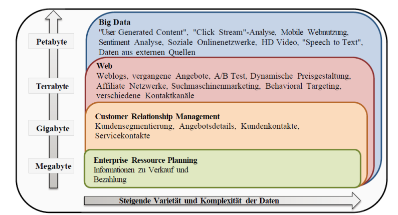

Big Data: Grundlagen
---------------------

Quelle: Big Data, Potential und Barrieren der Nutzung im Unternehmenskontext

---

Daten, die die Prozesskapazität von konventionellen Datenbanksystemen aufgrund der Menge, Schnelllebigkeit oder
inkompatiblen Struktur überschreiten. 

Daten die weit herogener als klassische Daten sind, u.a. durch hinzuziehen auch externer Daten für analytische Aufgaben.
 
Wenn mit Daten das geschlossene Datenuniversum einer Firma aufgesprengt wird um eine globalere Sicht auf das Unternehmen zu erhalten.

