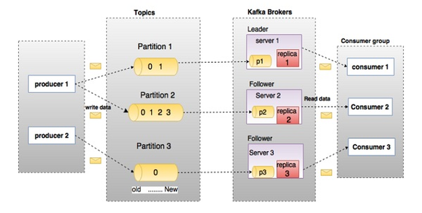

Topics und Partitionen
------

Quelle: <a href="https://www.tutorialspoint.com/apache_kafka/apache_kafka_quick_guide.htm">Apache Kafka - Quick Guide</a>

---

Streaming ermöglicht es Daten effizient über das Netzwerk zu übertragen. 

Wird Streaming als Punkt-zu-Punkt-Verbindung aufgebaut treten Probleme auf bei:
* **Zuwenig Daten vom Datenproduzenten** (Publisher), der Datennutzer (Consumer) benötigt unnötig Prozessorzeit, bzw. ist blockiert.
* **Zuviele Daten vom Publisher**, der Consumer kann die Daten nicht mehr verarbeiten und kann hier nur auf zwei Arten reagieren: den Produzenten, falls möglich, drosseln (Back Pressure) oder Daten wegwerfen.   
* Ausserdem besteht einen nicht gewünschte **fixe Abhängigkeit zwischen Publisher und Consumer**.

Um diese Probleme zu lösen verwendet Apache Kafka:

* das [Publish/Subscribe-Pattern](http://de.wikipedia.org/wiki/Beobachter_(Entwurfsmuster)). Es ersetzt die Punkt-zu-Punkt-Verbindungen durch einen zentralen Server (Broker), zu dem sich Datenproduzenten und -nutzer gleichermassen verbinden können. 
* Organisiert Kafka das Senden (publish) und Empfangen (subscribe) von Nachrichten in sogenannte Topics. Ein Topic ist ein String, der eine Art Betreff der Nachricht darstellt, aber ähnlich einer Web Adresse aufgebaut ist.
* Werden die Nachrichten an Topics in eine oder mehrere Partitionen unterteilt. Jede Partition stellt eine geordnete,
unveränderliche Abfolge von Nachrichten dar.  

### Links

- [Kafka Dokumentation](https://kafka.apache.org/documentation/)
- [Apache Kafka - Quick Guide](https://www.tutorialspoint.com/apache_kafka/apache_kafka_quick_guide.htm)
- [Using Apache Kafka Docker](http://howtoprogram.xyz/2016/07/21/using-apache-kafka-docker/)
- [Apache Kafka Connect MQTT Source Tutorial](http://howtoprogram.xyz/2016/07/30/apache-kafka-connect-mqtt-source-tutorial/)
- [Internet-of-Things And Akka Actors](http://blog.genuine.com/2016/04/internet-of-things-and-akka-actors/)

### Beispiel

Zookepper und Kafka Container starten

	bash /vagrant/kafka/kafka-server
	
Topic(s) erstellen
	
	bash /vagrant/kafka/kafka-topic test
	
Daten auf Topic schreiben. Es wird eine offene Topic Verbindung gestartet, die Eingaben gehen an den Consumer.

	bash /vagrant/kafka/kafka-publish test
	
In einem neuen Fenster, Daten des Topics konsumieren

	bash /vagrant/kafka/kafka-consume test
