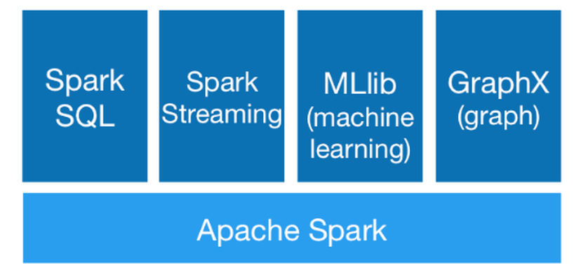

Fast Data - Spark
-----------------

<a href="http://spark.apache.org/">Quelle: Apache Spark</a>

---

**Problem:** Die oft inkompatiblen Programmiermodelle führten dazu, dass viel Logik mehrfach implementiert werden musste

**Lösung:**

Das AMPLab der University of California in Berkeley veröffentlichte 2010 ein neues Open-Source-Analysewerkzeug, das genau dieses Problem lösen sollte. [Spark](https://de.wikipedia.org/wiki/Apache_Spark) wurde 2013 zum Apache-Projekt und hat seither eine beeindruckende Entwicklung durchgemacht. 

**Im Kern dreht sich bei Spark alles um die so genannten Resilient Distributed Datasets (RDD): belastbare, verteilte, fehlertolerante, parallelisierbare Datenstrukturen.** 

Diese können in Verbindung mit vielen verschiedenen Modulen genutzt werden:

- Verarbeitung von Graphen ([GraphX](http://spark.apache.org/graphx/))
- Spark SQL, um mit den Daten aus verschiedenen strukturierten Datenquellen umzugehen (Hive, JDBC, Parquet etc.)
- Streaming (Kafka, HDFS, Flume, ZeroMQ, Twitter)
- Machine Learning basierend auf der [MLlib](https://spark.apache.org/docs/latest/ml-guide.html)

Durch die Kombination aus strukturierten Datenquellen und Streams ist es möglich, weite Teile des Speed Layers mit dem Batch Layer unter einer einheitlichen Oberfläche zu vereinen. Analysen können nun in beinahe beliebiger Auflösung durchgeführt werden. Spark-Jobs können auch von Nichtentwicklern in erstaunlicher Zeit entwickelt und deployt werden. 

**Argumente für Spark:**

- skalierbar, um auch mit Millionen von Datensätzen umgehen zu können
- schnell genug, um Antworten in Near Time zu liefern
- geeignet, um Analysen mit beliebiger Laufzeit umzusetzen
- ein einheitliches, verständliches Programmier­modell für den Umgang mit verschiedenen Datenquellen

Aber auch Spark hat seine Grenzen: **Tools zur Datenanlieferung und Persistierung sind weiterhin notwendig.** 

**Ziele Fast Data:**

- Niedrige Einstiegshürde für Data Scientists
- Unterschiede zwischen Speed und Batch Layer sollen verschwinden
- Explorative Analysen werden deutlich erleichtert
- Deployment neuer Jobs wird einfacher und schneller
- Bestehende Infrastruktur wird einfacher nutzbar

### Links

- [Home Page](http://spark.apache.org/)
- [Spark Quick Start](http://spark.apache.org/docs/latest/quick-start.html)
- [Datenanalyse mit Spark](https://github.com/daniel-pape/datenanalyse-mit-spark)
- [Learning Spark Examples](https://github.com/databricks/learning-spark.git)

### Beispiele

**Zeilen zählen und ausgeben:**

Spark Shell starten und README.md Datei im lokalen Verzeichnis auswerten. `Ctrl+D` und `exit` beendet die Sparkumgebung. 
Die Spark Shell verarbeitet [Scala](https://de.wikipedia.org/wiki/Scala_(Programmiersprache)) Anweisungen.

	bash /vagrant/spark/spark
	bin/spark-shell

**Datei README.md (im Spark Shell Verzeichnis) einlesen und analysieren:**

	val lines = sc.textFile("README.md")
	lines.count()
	lines.first()
	
	val pythonLines = lines.filter(line => line.contains("Python"))
	pythonLines.count()
	pythonLines.first()	
	pythonLines.take(10).foreach( println )		// liefert alle Zeilen mit Python
	
**Daten manipulieren und in neue RDD Abstellen**

	val input = sc.parallelize(List(1, 2, 3, 4))
	val result = input.map(x => x * x)
	println(result.collect().mkString(","))

	// Funktion auf jedes Element einer RDD anwenden
	val rdd = sc.parallelize(List(1, 2, 3, 3))
	var result = rdd.map(x => x + 1) 
	println(result.collect().mkString(","))

	// Alle Werte ausser 1 in RDD liefern
	val rdd = sc.parallelize(List(1, 2, 3, 3))
	var result = rdd.filter(x => x != 1) 
	println(result.collect().mkString(","))	

	// Doppelte Einträge entfernen
	val rdd = sc.parallelize(List(1, 2, 3, 3))
	var result = rdd.distinct() 
	println(result.collect().mkString(","))	

	// Zwei RDD zusammenführen
	val rdd = sc.parallelize(List(1, 2, 3))
	val other = sc.parallelize(List(3, 4, 5))
	var result = rdd.union( other ) 
	println(result.collect().mkString(","))	

	// Nur Werte welche in beiden RDD vorkommen
	val rdd = sc.parallelize(List(1, 2, 3))
	val other = sc.parallelize(List(3, 4, 5))
	var result = rdd.intersection( other ) 
	println(result.collect().mkString(","))		

	// Werte aus 1. RDD extrahieren, welche in 2. RDD vorkommen.
	val rdd = sc.parallelize(List(1, 2, 3))
	val other = sc.parallelize(List(3, 4, 5))
	var result = rdd.subtract( other ) 
	println(result.collect().mkString(","))		

	// Kartesisches Produkt - https://de.wikipedia.org/wiki/Kartesisches_Produkt 
	val rdd = sc.parallelize(List(1, 2, 3))
	val other = sc.parallelize(List(3, 4, 5))
	var result = rdd.cartesian( other ) 
	println(result.collect().mkString(","))		

	// Quersumme	
	val rdd = sc.parallelize(List(1, 2, 3, 3))
	val sum = rdd.reduce((x, y) => x + y)
	val sum = rdd.reduce((x, y) => x - y)
	
**GraphX anwenden:**

	import org.apache.spark._
	import org.apache.spark.graphx._
	// To make some of the examples work we will also need RDD
	import org.apache.spark.rdd.RDD
	
	val users: RDD[(VertexId, (String, String))] =
	  sc.parallelize(Array((3L, ("rxin", "student")), (7L, ("jgonzal", "postdoc")),
	                       (5L, ("franklin", "prof")), (2L, ("istoica", "prof"))))
	// Create an RDD for edges
	val relationships: RDD[Edge[String]] =
	  sc.parallelize(Array(Edge(3L, 7L, "collab"),    Edge(5L, 3L, "advisor"),
	                       Edge(2L, 5L, "colleague"), Edge(5L, 7L, "pi")))
	// Define a default user in case there are relationship with missing user
	val defaultUser = ("John Doe", "Missing")
	// Build the initial Graph
	val graph = Graph(users, relationships, defaultUser)
	
	val facts: RDD[String] =
	  graph.triplets.map(triplet =>
	    triplet.srcAttr._1 + " is the " + triplet.attr + " of " + triplet.dstAttr._1)
	facts.collect.foreach(println(_))

Details siehe [GraphX Programming Guide](http://spark.apache.org/docs/latest/graphx-programming-guide.html)
