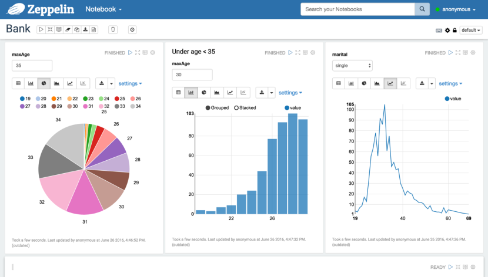
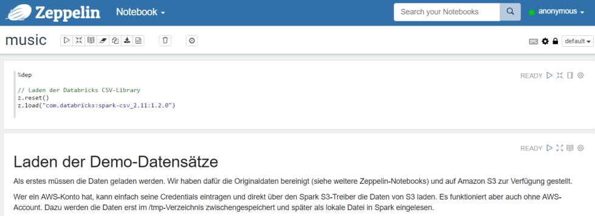

Apache Zepplin
--------------

<a href="http://zeppelin.apache.org/">Quelle: Apache Zeppelin</a>

---

Apache Zeppelin ist ein Frontend welche mit mehreren Systemen zusammenarbeiten kann.
 
Aktuell unterstützt Apache Zeppelin Systeme wie Apache Spark, Python, JDBC, Markdown and Shell.

### Anwendungen

- Data Ingestion
- Data Discovery
- Data Analytics
- Data Visualization & Collaboration

### Links

- [Homepage](http://zeppelin.apache.org/)
- [Datenanalyse mit Spark](https://github.com/daniel-pape/datenanalyse-mit-spark)

### Beispiele

Auf Basis des [Million Song Dataset](http://labrosa.ee.columbia.edu/millionsong/) der Firma Nest (jetzt Teil von Spotify) 

Der Datensatz beinhaltet Informationen zu rund einer Millionen Songs der Gegenwartsmusik. Das Taste Profile Subset enthält für eine Million Nutzer aus nicht öffentlich genannten Internetplattformen die Angabe, wie oft ein Nutzer einen Song abgespielt hat. 

Diesen Datensatz werden wir nutzen, um ein einfaches Empfehlungssystem für Musikstücke zu entwickeln: Wir wollen auf Basis des Hörverhaltens der Nutzer ähnliche Künstler empfehlen.

Die Daten liegen in Form von zwei CSV-Dateien vor. Die wichtigste dieser Tabellen besteht aus Dreiergruppen von Nutzer-ID, Song-ID und der Zahl PlayCounts, die ausdrückt, wie oft der Nutzer einen Song abgespielt hat. 

Datei train_triplets.txt

    UserId                                      SongId                PlayCounts
    b80344d063b5ccb3212f76538f3d9e43d87dca9e    SOAKIMP12A8C130995    1
    b80344d063b5ccb3212f76538f3d9e43d87dca9e    SOAPDEY12A81C210A9    1
    b80344d063b5ccb3212f76538f3d9e43d87dca9e    SOBBMDR12A8C13253B    2

Als Zusatzinformationen liefert die zweite Datei eine Tabelle, die jeder Song-ID einen Künstler und Songtitel zuordnet. Die ebenfalls vorhandene Track-ID wird hier nicht benutzt.
	
	TrackId               SongId                Artist              Title
	TRMBBVY128F426A8F3    SOBXXET12A8C1395CC    Dean Martin         Once In A While
	TRMBBAL128F92E4B44    SOKVJAF12A8C142B25    Jonathan Coulton    First of May

Das komplette Beispiel ist, aufbereitet in einem Docker Container, wie folgt startbar:

	bash /vagrant/zeppelin/zeppelin
	
Nach dem Start kann auf das [User Interface](http://localhost:7080) von Apache Zeppelin gewechselt werden.

Dort ist mittels `import note` ein neues Notebook zu erstellen und nachfolgende Datei mittels `Add from URL` zum importieren:

	https://raw.githubusercontent.com/daniel-pape/datenanalyse-mit-spark/master/notebooks/Datenanalyse-mit-Spark.json
	
Nach dem Öffnen des importierten Notebooks erscheint ein Tutorial, welches Schritt für Schritt in Zeppelin einführt.

 

